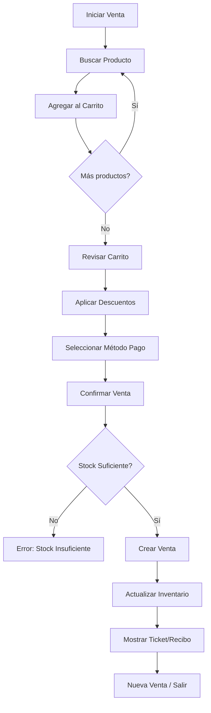

# 📦 API de Inventarios y Ventas - Resumen de Implementación

## 🎯 Objetivo
Construir un módulo completo de **inventarios y ventas** para el sistema de gimnasio, siguiendo arquitectura limpia y diseño modular.

---

## 🏗️ Arquitectura Implementada

### **Clean Architecture** con 4 capas:

```
internal/
├── domain/
│   ├── entities/          # Entidades de negocio con lógica
│   └── repositories/      # Interfaces de repositorios
├── usecases/             # Casos de uso (lógica de negocio)
├── infrastructure/
│   ├── persistence/      # Implementaciones SQLite
│   └── http/
│       ├── dto/          # Data Transfer Objects
│       └── handlers/     # Controladores HTTP
└── config/               # Configuración y DB
```

---

## 📊 Entidades Creadas

### 1. **Product** (Producto)
```go
- ID: UUID
- Name: string
- Description: string
- UnitPrice: float64
- Stock: int
- Status: "active" | "inactive"
- Métodos: HasStock(), DecreaseStock(), IncreaseStock()
```

### 2. **SalePaymentMethod** (Método de Pago)
```go
- ID: UUID
- Name: string
- Type: "cash" | "card" | "transfer"
- Status: "active" | "inactive"
```

### 3. **Sale** (Venta)
```go
- ID: UUID
- SaleDate: time
- Total: float64
- TotalDiscount: float64
- UserID: UUID (quien registra la venta)
- Type: "normal" | "void" (normal o anulación)
- Status: "completed" | "voided" | "pending"
- PaymentMethodID: UUID
- VoidedSaleID: *UUID (referencia a venta anulada)
- Details: []SaleDetail (líneas de venta)
- Métodos: CalculateTotal(), IsVoid(), CanBeVoided()
```

### 4. **SaleDetail** (Detalle de Venta)
```go
- ID: UUID
- SaleID: UUID
- ProductID: UUID
- Quantity: int
- UnitPrice: float64
- TotalPrice: float64
- Discount: float64
- Subtotal: float64
- Métodos: CalculateSubtotal(), Validate()
```

---

## 🔧 Repositorios Implementados

### ProductRepository
- `Create(product)` - Crear producto
- `GetByID(id)` - Obtener por ID
- `GetAll(status)` - Listar con filtro opcional
- `Update(product)` - Actualizar
- `Delete(id)` - Eliminar
- `Search(query)` - Búsqueda por nombre
- `UpdateStock(id, quantity)` - Actualizar stock

### PaymentMethodRepository
- `Create(method)` - Crear método
- `GetByID(id)` - Obtener por ID
- `GetAll(status)` - Listar con filtro
- `Update(method)` - Actualizar
- `Delete(id)` - Eliminar

### SaleRepository
- `Create(sale)` - Crear venta
- `GetByID(id)` - Obtener por ID
- `GetAll()` - Listar todas
- `Update(sale)` - Actualizar
- `GetByDateRange(start, end, userID?)` - Ventas por rango de fechas
- `GetSalesReport(start, end, userID?)` - Reporte agregado
- `GetSalesReportByProduct(start, end)` - Reporte por producto

### SaleDetailRepository
- `Create(detail)` - Crear detalle
- `CreateBatch(saleID, details[])` - Crear múltiples
- `GetBySaleID(id)` - Obtener detalles de una venta
- `GetByID(id)` - Obtener por ID

---

## 🎯 Casos de Uso (Business Logic)

### ProductUseCase
- ✅ Validación de datos
- ✅ Generación de UUIDs
- ✅ Gestión de stock con validaciones
- ✅ Control de estado (activo/inactivo)

### SaleUseCase
- ✅ **Creación de venta transaccional:**
  - Validar productos existen
  - Validar stock suficiente
  - Calcular totales automáticamente
  - Descontar inventario
  - Crear venta + detalles en transacción
  
- ✅ **Anulación de venta (Void):**
  - Crear venta tipo "void" con monto negativo
  - Restaurar inventario
  - Mantener trazabilidad (VoidedSaleID)
  - Cambiar status a "voided"

- ✅ **Reportes:**
  - Ventas por rango de fechas
  - Agregados (total, descuentos, neto)
  - Por producto (cantidad vendida, ingresos)

---

## 🌐 Endpoints HTTP Implementados

### **Productos** (`/api/v1/products`)
| Método | Endpoint | Descripción |
|--------|----------|-------------|
| GET | `/products` | Listar todos los productos |
| GET | `/products/search?q=nombre` | Buscar productos |
| GET | `/products/:id` | Obtener producto por ID (UUID) |
| POST | `/products` | Crear producto |
| PUT | `/products/:id` | Actualizar producto |
| DELETE | `/products/:id` | Eliminar producto |
| PATCH | `/products/:id/stock` | Actualizar stock |

**Request Body (POST/PUT):**
```json
{
  "name": "Proteína Whey",
  "description": "Suplemento proteico 1kg",
  "unit_price": 45.99,
  "stock": 50,
  "status": "active"
}
```

### **Métodos de Pago** (`/api/v1/payment-methods`)
| Método | Endpoint | Descripción |
|--------|----------|-------------|
| GET | `/payment-methods` | Listar métodos |
| GET | `/payment-methods/:id` | Obtener por ID (UUID) |
| POST | `/payment-methods` | Crear método |
| PUT | `/payment-methods/:id` | Actualizar método |
| DELETE | `/payment-methods/:id` | Eliminar método |

**Request Body (POST/PUT):**
```json
{
  "name": "Efectivo",
  "type": "cash",
  "status": "active"
}
```

### **Ventas** (`/api/v1/sales`)
| Método | Endpoint | Descripción |
|--------|----------|-------------|
| GET | `/sales` | Listar todas las ventas |
| GET | `/sales/by-date?start_date=2026-01-01&end_date=2026-01-31&user_id=uuid` | Ventas por rango |
| GET | `/sales/report?start_date=2026-01-01&end_date=2026-01-31` | Reporte agregado |
| GET | `/sales/report/by-product?start_date=2026-01-01&end_date=2026-01-31` | Reporte por producto |
| GET | `/sales/:id` | Obtener venta por ID (UUID) |
| POST | `/sales` | Crear venta |
| POST | `/sales/:id/void` | Anular venta |

**Request Body (POST /sales):**
```json
{
  "payment_method_id": "uuid-del-metodo",
  "details": [
    {
      "product_id": "uuid-del-producto",
      "quantity": 2,
      "unit_price": 45.99,
      "discount": 5.00
    }
  ]
}
```

**Response (Sale):**
```json
{
  "id": "uuid",
  "sale_date": "2026-02-12T10:30:00Z",
  "total": 86.98,
  "total_discount": 10.00,
  "user_id": "uuid-vendedor",
  "type": "normal",
  "status": "completed",
  "payment_method_id": "uuid",
  "created_at": "2026-02-12T10:30:00Z",
  "details": [
    {
      "id": "uuid",
      "product_id": "uuid",
      "product_name": "Proteína Whey",
      "quantity": 2,
      "unit_price": 45.99,
      "total_price": 91.98,
      "discount": 5.00,
      "subtotal": 86.98
    }
  ]
}
```

---

## 🔐 Seguridad y Permisos

Todos los endpoints requieren:
- ✅ **Autenticación JWT** (middleware `AuthMiddleware`)
- ✅ **Roles autorizados:** `SUPER_ADMIN`, `ADMIN_GYM`, `RECEPCIONISTA`
- ✅ **UUID validation** en parámetros de ruta
- ✅ **Error handling** consistente

---

## 💾 Base de Datos

### Tablas Creadas (Auto-Migrate GORM):
- `products`
- `sale_payment_methods` (renombrado para evitar conflicto)
- `sales`
- `sale_details`

### Datos Semilla (Seed):
Al iniciar la aplicación se crean automáticamente:
- 💵 Efectivo (cash)
- 💳 Tarjeta (card)
- 🏦 Transferencia (transfer)

### Integridad Referencial:
- ✅ Foreign keys habilitadas en SQLite
- ✅ Relaciones definidas con UUIDs
- ✅ Triggers para mantener consistencia

---

## 🎨 Frontend - PENDIENTE

### Lo que falta implementar:

#### 1️⃣ **Gestión de Productos** (`ProductsTab.jsx`)
- [ ] Tabla de productos con búsqueda
- [ ] Modal crear/editar producto
- [ ] Actualizar stock directamente
- [ ] Filtrar por estado (activo/inactivo)
- [ ] Indicador visual de stock bajo

#### 2️⃣ **Sistema de Ventas/Punto de Venta** (`SalesTab.jsx`)
- [ ] **Carrito de venta:**
  - Buscar y agregar productos
  - Ajustar cantidades
  - Aplicar descuentos por línea
  - Mostrar totales en tiempo real
- [ ] **Proceso de pago:**
  - Seleccionar método de pago
  - Confirmar venta
  - Imprimir/ver ticket
- [ ] **Historial de ventas:**
  - Lista de ventas con filtros
  - Ver detalle de venta
  - Anular venta (void)

#### 3️⃣ **Reportes** (`ReportsTab.jsx`)
- [ ] **Reporte de ventas:**
  - Selector de fechas
  - Filtro por vendedor opcional
  - Totales: ventas brutas, descuentos, neto
  - Cantidad de ventas
- [ ] **Reporte por producto:**
  - Productos más vendidos
  - Ingresos por producto
  - Cantidades vendidas

#### 4️⃣ **Métodos de Pago** (Administración)
- [ ] CRUD básico de métodos de pago
- [ ] Solo para `ADMIN_GYM` y `SUPER_ADMIN`

---

## 📋 Estructura de Frontend Sugerida

```javascript
frontend/src/components/
├── inventory/
│   ├── ProductsTab.jsx        // Gestión de productos
│   ├── ProductForm.jsx         // Modal crear/editar
│   ├── ProductsList.jsx        // Tabla de productos
│   ├── StockBadge.jsx          // Indicador stock
│   └── ProductSearch.jsx       // Búsqueda
├── sales/
│   ├── SalesTab.jsx            // Vista principal POS
│   ├── SaleCart.jsx            // Carrito de compra
│   ├── ProductSelector.jsx     // Buscar productos
│   ├── PaymentModal.jsx        // Finalizar venta
│   ├── SalesHistory.jsx        // Historial
│   ├── SaleDetail.jsx          // Ver detalle
│   └── VoidSaleModal.jsx       // Anular venta
├── reports/
│   ├── ReportsTab.jsx          // Vista reportes
│   ├── SalesReport.jsx         // Reporte ventas
│   ├── ProductReport.jsx       // Reporte por producto
│   └── DateRangePicker.jsx     // Selector fechas
└── payment-methods/
    ├── PaymentMethodsTab.jsx   // Gestión métodos
    └── PaymentMethodForm.jsx   // CRUD form
```

---

## 🔄 Flujo de Venta Completo



---

## 🚀 Estado Actual

### ✅ COMPLETADO (Backend)
- [x] Domain entities con business logic
- [x] Repository interfaces y implementations
- [x] Use cases con validaciones
- [x] HTTP handlers con error handling
- [x] DTOs para request/response
- [x] Routing y middleware
- [x] Database migrations
- [x] Seed data (payment methods)
- [x] UUID system
- [x] Transactional operations
- [x] Void/cancellation system
- [x] Reporting agregado

### 📝 PENDIENTE (Frontend)
- [ ] Components React para cada módulo
- [ ] Integration con API (axios/fetch)
- [ ] State management (Context API / Redux)
- [ ] UI/UX para punto de venta
- [ ] Validaciones en formularios
- [ ] Notificaciones toast
- [ ] Loading states
- [ ] Error boundaries

---

## 💡 Notas Técnicas

### Sistema de UUIDs
- Todos los IDs usan UUID v4
- Los handlers parsean strings a UUID
- Los DTOs convierten UUID a string para JSON

### Manejo de Errores Personalizado
```go
pkg/errors/errors.go
- ErrNotFound
- ErrInvalidInput
- ErrInsufficientStock
- ErrSaleCannotBeVoided
```

### Conflicto de Nombres Resuelto
- Entidad existente: `PaymentMethod` (para subscripciones)
- Nueva entidad: `SalePaymentMethod` (para ventas)
- Constantes: `PaymentTypeCash`, `PaymentTypeCard`, `PaymentTypeTransfer`

---

## 🎯 Próximo Paso: Frontend

Para el siguiente prompt, necesito que:

1. **Crees los componentes React** para gestión de inventario
2. **Implementes un POS (Punto de Venta)** moderno y funcional
3. **Integres con los endpoints** ya disponibles
4. **Diseñes reportes visuales** con gráficas
5. **Implementes validaciones** del lado del cliente
6. **Uses TailwindCSS** (ya configurado en el proyecto)

### Estructura de Petición para el Siguiente Prompt:

```
Necesito implementar el frontend del módulo de inventarios y ventas.
Ya tengo el backend completo (ver INVENTORY_API_SUMMARY.md).

Requisitos:
1. Sistema de gestión de productos (CRUD + búsqueda)
2. Punto de venta (POS) con carrito interactivo
3. Historial de ventas con opción de anular
4. Reportes de ventas (por fecha y por producto)
5. Gestión de métodos de pago (solo admin)

Stack: React + TailwindCSS + Axios
Debe integrarse con Dashboard.jsx existente como nuevas tabs.
```

---

**Autor:** GitHub Copilot  
**Fecha:** 12 de Febrero, 2026  
**Proyecto:** gym-go - Sistema de Gestión para Gimnasios
